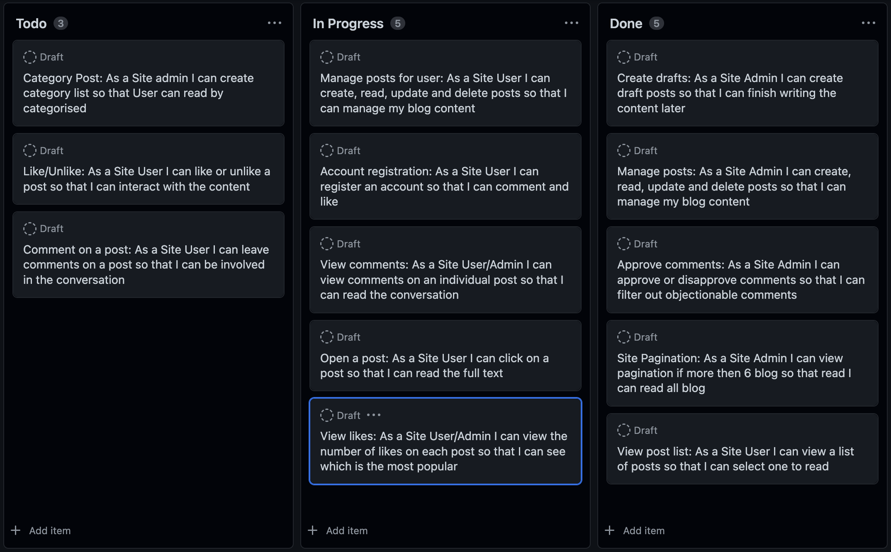
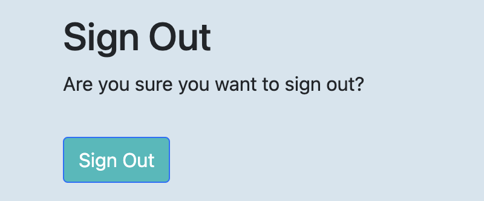

# Anushilon Blog
(Developer: Yakub Ali)

[Live webpage](https://anushilon2022.herokuapp.com/)

# Contents
[UX](#ux)
- [About](#about)
- [User Stories](#user-stories)
- [Wireframes](#wireframes)
- [Agile Methodology](#Agile-Methodology)

[Existing Features](#existing-features)
- [Navbar and Footer](#Navbar-and-Footer)
- [Home Page](#Home-page)
- [Cloudinary API](#Cloudinary-APIs)
- [Form Validation](#Form-Validation)

## UX 
------

### About

Anushillon is like blog tipe of apps. User can read many kind of post by categorised but register user can read, create, update, delete post and like, comment post (Authenticated user only). 

### User Stories

GitHub issues were used to record the user stories. The user stories were categorised into different priorities.

### Wireframes

I have designed both desktop and mobile wireframes in the same time but I have taken mobile first approach. This app look good and work well on both desktop and mobile device.

### Agile Methodology

Github issues were used to create the User stories and acceptance criteria. Link to the project with live issues can be found [here](https://github.com/users/mamuzaan/projects/4).  

## Existing Features
--------------------

### Navbar and Footer

Navbar and Footer hase been copied from a part of Bootstrap components and adjusted to the needs of the project.

I have used a beautiful navbar with icons found in bootstrap examples in headers. The design was quite unique and bootstrap classes have hindered the design.

When user login in the web page, navbar look like so

If user is not register user, so user vate to sign up. User have to registera with username, email(optional), and password. Sign up page look like so

Whwn user log out the web page, user can see this page

Footer contains only minimal information about the author of the page. It stays at the bottom of the page. Footer look like below

### Home Page
Home page consists of a hero with a short message of blogs with card and a little image reffering to tank

User can read, create, update and delete post like CRUD if user is authenticated. home page look so

Second part of the home page is detail page of blogs. The detail page is generated dynamicly when user click in blog post and user can like post. 

User can comment blog post. If site owner approve comment, user can see comments in the left side on the screen. 

