# Anushilon Blog

(Developer: Yakub Ali)

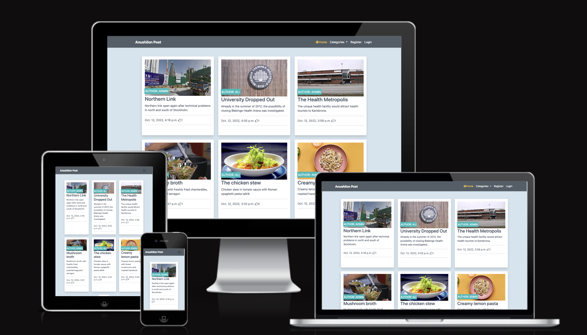

[Live webpage](https://anushilon2022.herokuapp.com/)

## Contents

[UX](#ux)

- [About](#about)
- [User Stories](#user-stories)
- [Wireframes](#wireframes)
- [Agile Methodology](#agile-methodology)

[Existing Features](#existing-features)

- [Navbar and Footer](#navbar-and-footer)
- [Home Page](#home-page)
- [Cloudinary API](#cloudinary-api)
- [Form and code validation](#form-and-code-validation)

[Technologies Used](#technologies-used)

- [Languages Used](#language-used)
- [Frameworks, Libraries & Programs Used](#frameworks-libraries-and-programs-used)
- [Database](#database model structure)

[Tests](#tests)

- [Automated Tests](#automated-tests)
- [Lighthouse](#lighthouse)

[Deployment](#deployment)

- [Deployment to heroku](#deployment-to-heroku)
- [Setting up local enviroment](#setting-up-local-environment)

[Credit](#credits)

- [Online resources](#online-resources)
- [Tutorials and inspiration](#tutorials-and-inspiration)
- [People](#people)

## UX

------

### About

Anushillon is like blog tipe of apps. User can read many kind of post by categorised but register user can read, create, update, delete post and like, comment post (Authenticated user only).

### User Stories

GitHub issues were used to record the user stories. The user stories were categorised into different priorities.

### Wireframes

I have designed both desktop and mobile wireframes in the same time in figma.com but I have taken mobile first approach. This app look good and work well on both desktop and mobile device.

#### Mobile and Desktop device

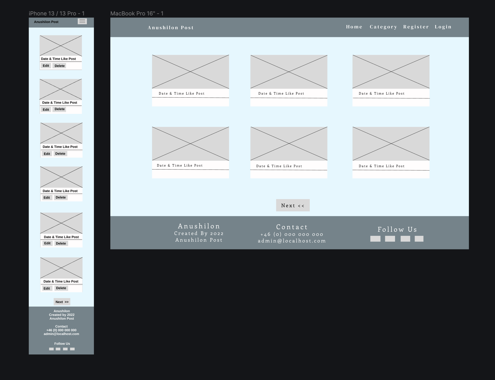

##### Detail page

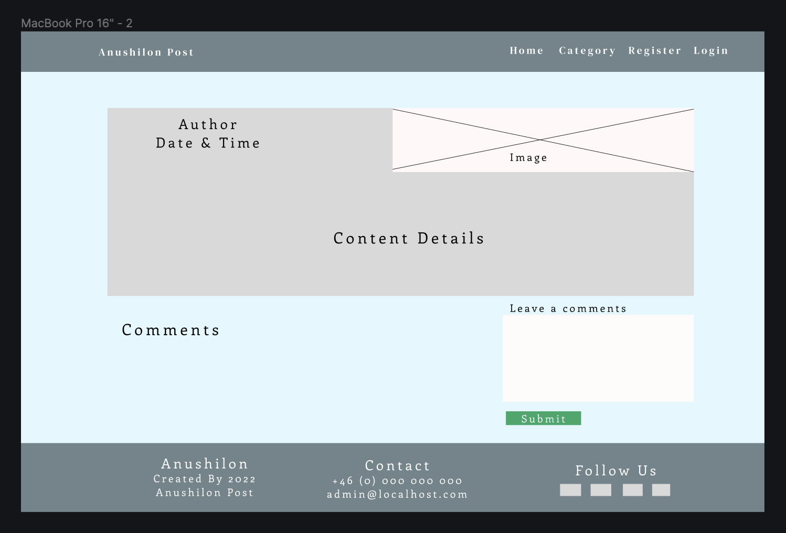

##### User register view

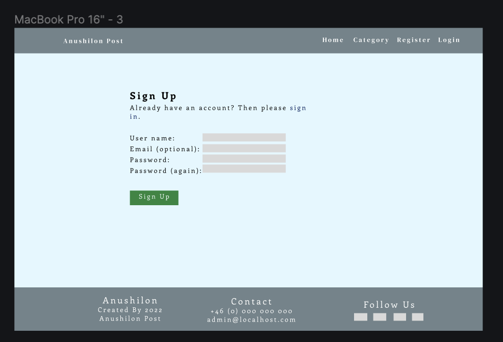

##### User create post view

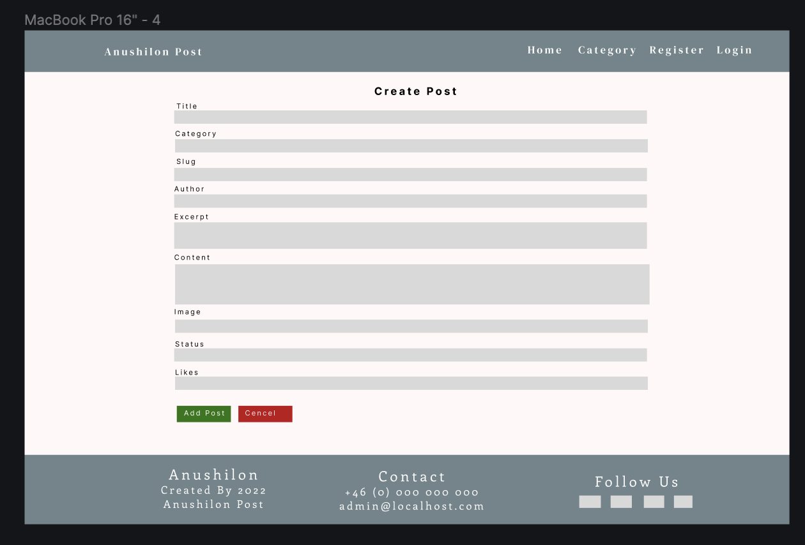

### Agile Methodology

Github issues were used to create the User stories and acceptance criteria. Link to the project with live issues can be found [here](https://github.com/users/mamuzaan/projects/4).  

## Existing Features

------

### Navbar and Footer

Navbar and Footer hase been copied from a part of Bootstrap components and adjusted to the needs of the project.

I have used a beautiful navbar with icons found in bootstrap examples in headers. The design was quite unique and bootstrap classes have hindered the design.

When user login in the web page, navbar look like so

If user is not register user, so user vate to sign up. User have to registera with username, email(optional), and password. Sign up page look like so

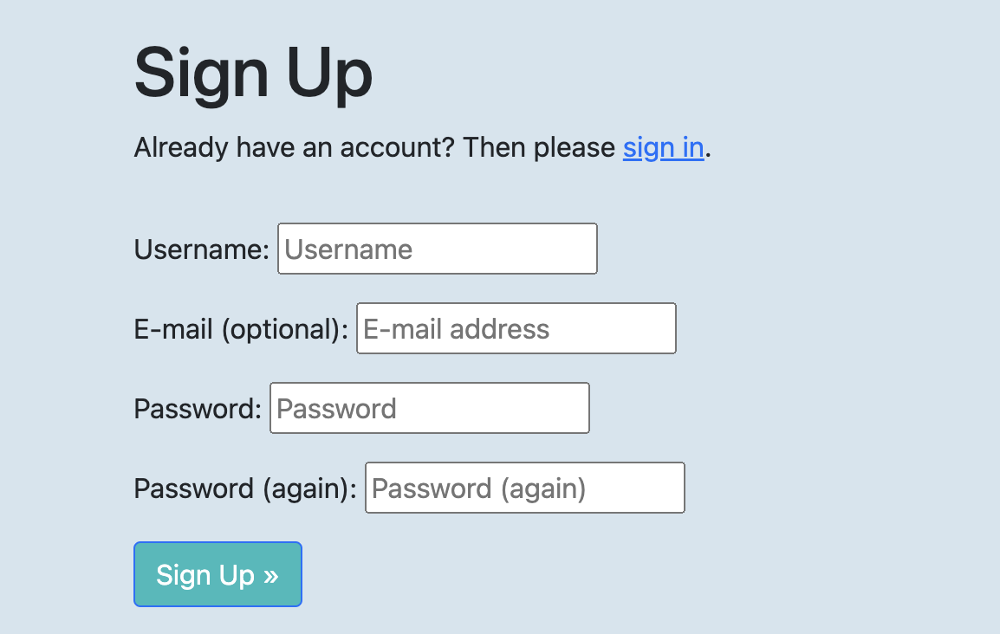

Whwn user log out the web page, user can see this page

Footer contains only minimal information about the author of the page. It stays at the bottom of the page. Footer look like below

### Home Page

Home page consists of a hero with a short message of blogs with card and a little image reffering to tank

User can read, create, update and delete post like CRUD if user is authenticated. home page look so

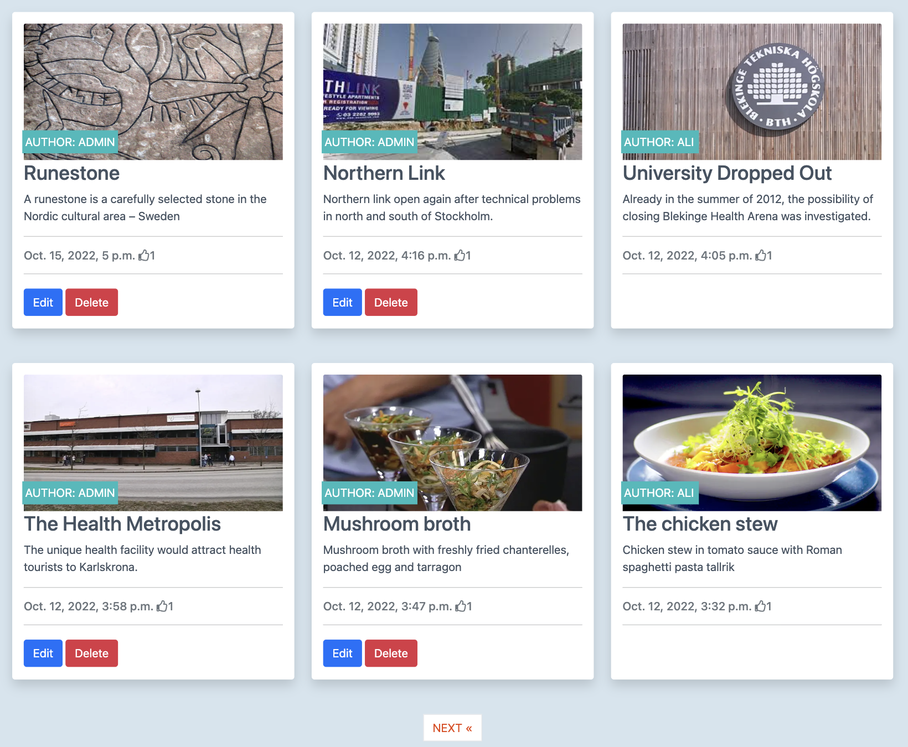

Second part of the home page is detail page of blogs. The detail page is generated dynamicly when user click in blog post and user can like post.

User can comment blog post. If site owner approve comment, user can see comments in the left side on the screen.

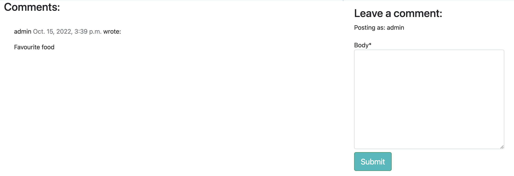

### Cloudinary API

This is Cloud based website. When user add post image in the blog, image store in the cloud based site in cloudinary. Thats why cloudinary API key add to the heroku apps and added code the settings file

### Form and code Validation

Form Validation

1. HTML validation using HTML attribute
2. CSS Validation
3. Javascript validation
4. Django form validation

**1. HTML Validation**
Some inline css shows fail but it was fixed problem W3C validation. Screenshot report shows below

**2. CSS Validation**
CSS file was tested by W3C css validation and everything was well. Screenshot report shows below

**3. Javascript Validation**
This file was tested by jshint.com and everything was well.
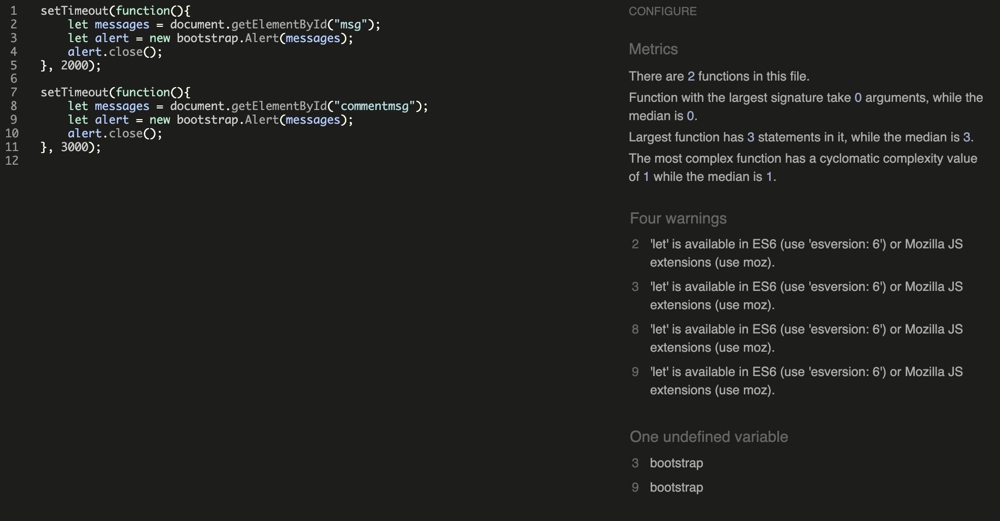

**4. Django code validation**
PEP8online.com site is not available at the moment. Its corrently down and thats why I use pycodestyle in gitpod workspace. In the django framework, python code validation complated by gitpod workspace. It shows problem at starting like "line is too long" but now it fixed.

- anushilon2022
  - **init**.py
  - asgi.py
  - settings.py
  - urls.py
  - wsgi.py

- rsnblog
  - **init**.py
  - admin.py
  - apps.py
  - forms.py
  - models.py
  - tests.py
  - urls.py
  - views.py
  - env.py
  - manage.py

## Technologies Used

------

### Language Used

    - HTML 5
    - CSS 3
    - JavaScript
    - Python
    - Django

### Technologies and Program Used

    - GitHub
        The Git was used for version control
        Git issues were used for user stories
        GitPod was used as IDE to write the code and push to GitHub
    
    - Heroku
        The page was deployed to Heroku
    - PostgreSQL
        PostgreSQL was used as database for this project
    - Cloudinary storage
        Cloudinary used for storing static files
    - Allauth
        Allauth functionality used for page inloggning.

### Frameworks Libraries and Programs Used

    - Bootstrap 5
        Bootstrap was used to add style to the website.
    - Django
        This is python framework and used this project.
    - Database
        Database model schema structure added below

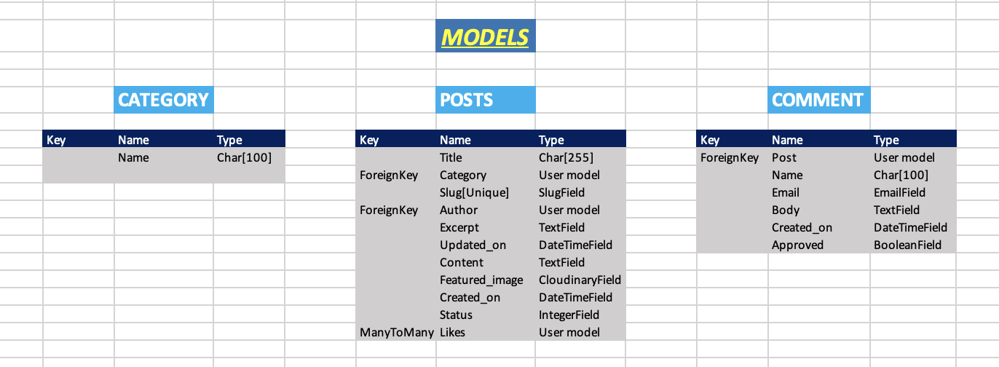

## Tests

------

### Automated tests

Automated tests already fixed on W3School, JShint and pycodetest(gitpod)

### Lighthouse

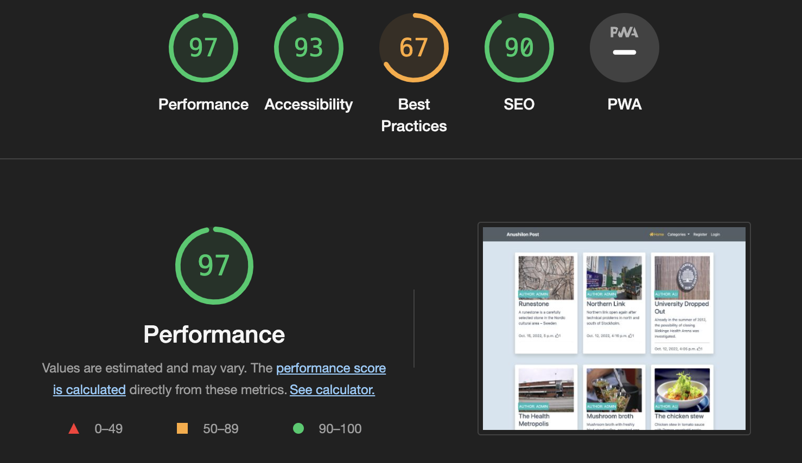

The Lighthouse in Chrome dev tools has been run. The results indicated very positive outcome of testing Accessibility, Best Practice and SEO, unfortunately the Best Practice has been assesed very low.

## Deployment

### Deployment to heroku

## In the app

1. add the list of requirements by writing in the terminal "pip3 freeze --local > requirements.txt"
2. Git add and git commit the changes made

## Log into heroku

1. Log into [Heroku](https://dashboard.heroku.com/apps) or create a new account and log in

2. top right-hand corner click "New" and choose the option Create new app, if you are a new user, the "Create new app" button will appear in the middle of the screen

3. Write app name - it has to be unique, it cannot be the same as this app
4. Choose Region - I am in Europe
5. Click "Create App"

**The page of project opens.**

1. Go to Resources Tab, Add-ons, search and add Heroku Postgres

2. Choose "settings" from the menu on the top of the page

3. Go to section "Config Vars" and click button "Reveal Config Vars".

4. Add the below variables to the list

    - Database URL will be added automaticaly
    - Secret_key - is the djnago secret key can be generated self
    - Cloudinary URL can be obtained from [cloudinary](https://cloudinary.com/) follow the steps on the website to register.
    - Google API key can be obtained [here](https://cloud.google.com/gcp?authuser=1)

## Go back to code

1. Procfile needs to be created in your app

'''
web: gunicorn PROJ_NAME.wsgi
'''

1. In settings in your app add Heroku to ALLOWED_HOSTS

2. Add and commit the changes in your code and push to github

## Final step - deployment

1. Next go to "Deploy" in the menu bar on the top

2. Go to section "deployment method", choose "GitHub"

3. New section will appear "Connect to GitHub" - Search for the repository to connect to

4. type the name of your repository and click "search"

5. once Heroku finds your repository - click "connect"

6. Scroll down to the section "Mamual Deploys"

7. Click choose "Deploy branch" and manually deploy

8. Click "Deploy branch"

Once the program runs:
you should see the message "the app was sussesfully deployed"

1. Click the button "View"

### Setting up local environment

1. Create Virtual enviroment on computer or use gitpod built in virtual enviroment feature.

2. Create env.py file in the top directory. It needs to contain those variables.

- Database URL can be obtained from [heroku](https://dashboard.heroku.com/), add PostgreSQL as an add on when creating an app.
- Secret_key - is the djnago secret key can be generated self.
- Cloudinary URL can be obtained from [cloudinary](https://cloudinary.com/) follow the steps on the website to register.

'''
os.environ["DATABASE_URL"] = "..."
os.environ["SECRET_KEY"] = "..."
os.environ["CLOUDINARY_URL"] = "..."
'''

1. Run command

'''
pip3 install -r requirements.txt
'''

## Credits

### Online resources

    - [W3School](https://www.w3schools.com/)
    - [Fontawsome](https://fontawesome.com/)
    - [Markdown best practices](https://www.markdownguide.org/basic-syntax/)
    - [Bootstrap 5](https://getbootstrap.com/docs/5.0/getting-started/introduction/)
    - [Stackoverflow](https://stackoverflow.com/)

### Tutorials and inspiration

- The project walkthrough I Think Therefore I Blog tutorial in this course whose provided instpiration for make this project.
- Hello Django tutorial by Mr Zielinski. Link to repository can be found [here](https://github.com/ckz8780/ci-fsf-hello-django/tree/c13b414fd2e87a54b4f2788ceffec55be4ade925) This helped me to understand various Django errors.
- To create projects readme video tutorial by JoGorska on slack.

### People

- Get mentor support on this project.
- Get a lot of tutor support when I stop in the middle of project.
